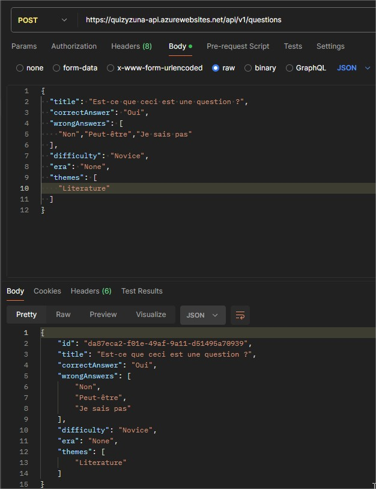
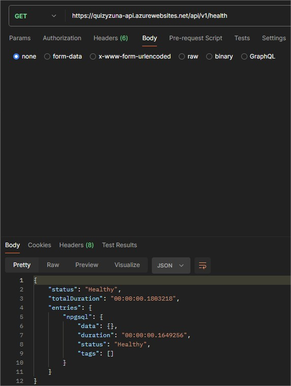
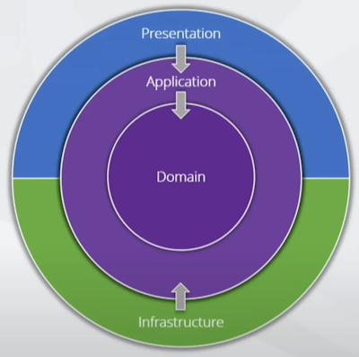
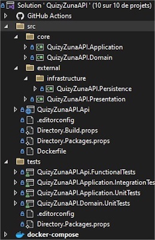

# Quel est ce projet ?  
  
QuizyZunaAPI est une API web en C# & [ASP.NET](http://ASP.Net) Core Web API qui suit les principes de la **Clean Architecture**. L’API propose les opérations **Create Read Update Delete (CRUD)** sur des questions dans l’idée d’être utilisée par un front-end pour proposer un party-game de culture générale en conjonction.  
  
Par la suite, le site proposera aux utilisateurs de créer leurs propres quiz et les personnaliser pour pouvoir les faire jouer à leurs amis ou à un public.  
  
Le nom vient de la fusion entre le mot Quiz et le mot Kizuna qui signifie “les liens entre les gens” en japonais.  
  
# Sommaire  
  
- [Quel est ce projet ?](#Quel-est-ce-projet-?)  
- [Sommaire](#Sommaire)  
- [Technologies Utilisées](#Technologies-Utilisées)  
- [Objectif](#Objectif)  
- [État du projet](#État-Du-Projet)   
- [Comment lancer le projet en local avec Docker ?](#Comment-lancer-le-projet-en-local-avec-Docker-?)  
- [Comment lancer le projet en local sans Docker ?](#Comment-lancer-le-projet-en-local-sans-Docker-?)  
- [Comment essayer l'API sur Azure ?](#Comment-essayer-l'API-sur-Azure-?)  
- [Continuous Integration / Continuous Deployment](#Continuous-Integration-/-Continuous-Deployment)  
- [Clean Architecture](#Clean-Architecture)  
- [Clean Code](#Clean-Code)  
	- [SOLID](#SOLID)  
	- [Object Calisthenics](#Object-Calisthenics)  
- [Choix techniques](#Choix-Techniques)  
	- [Problématiques transverses](#Problématiques-transverses)  
	- [Structure du projet](#Structure-du-projet)  
	- [Domain](#Domain) 
		- [Modélisation](#Modélisation) 
		- [Domaine métier riche](#Domaine-métier-riche) 
		- [Primitive Obsession](#Primitive-Obsession) 
	- [Application](#Application)  
	- [Infrastructure](#Infrastructure)  
	- [Présentation](#Présentation)  
- [Tests](#Tests)  
	- [Unitaires](#Unitaires)  
	- [Intégration](#Intégration)  
	- [Fonctionnels](#Fonctionnels)  
- [Licence](#Licence)  

# Technologies utilisées  
  
* [ASP.NET](http://ASP.Net) Core (.NET 8) Web API
* Entity Framework Core (EFCore 8)
* MediatR pour .NET 8
* Fluent Validation pour .NET 8
* PostgreSQL
* SwaggerUI
* Docker
  
# Objectif
  
L'objectif de ce projet est de mettre en pratique la majorité des connaissances que j'ai accumulées au cours de ces dernières années au profit d'un projet d'application web qui me tient à cœur.  
  
C'est également une occasion de m'occuper pour la première fois d'un projet seul sur tous les points, de la conception jusqu'au déploiement et la mise en œuvre.  
  
J'ai ensuite pu comparer et choisir les technologies et méthodologies qui me paraissaient les plus pertinentes sur lesquelles me former ou approfondir ma maîtrise. La plupart de ces choix sont justifiés et expliqués par la suite, en omettant volontairement des éléments qui n'apparaissent pas dans ce projet, car inapdapté à celui-ci.  
  
# État du projet  
  
L'API est dans une version stable qui permet de réaliser les opérations **CRUD** sur les questions comme prévu.  
  
L'état actuel peut être considéré comme un produit satisfaisant pour une première version. Il reste cependant plusieurs points qui doivent être abordés, notamment côté sécurité de l'API. Voici les problématiques à traiter dans les prochaines versions pour améliorer l'existant :  
  
* Authentification  
* Autorisation  
* Cross Origine Ressource Sharing (CORS)  
* Mise en cache des données avec **Redis**  
* Résilience avec **Polly**  
* Localisation
* Surveillance des métriques
  
D'autres éléments devront être intégrés avec l'ajout de nouvelles fonctionnalités :  
  
* Traitement d'informations en temps-réel avec **SignalR**  
* Création de quiz personnalisés  
* Import de fichiers
* Option dans le getAll des questions pour équilibrer au mieux les thèmes des questions retournées

# Comment lancer le projet en local avec Docker ?  
  
Pour commencer, suivez ses étapes :  
  
1. Installer **.NET** 8 SDK  
2. Installer **Docker** Desktop (Windows) / **Docker** (Linux/Mac)  
3. Cloner la solution  
4. Se placer dans le répertoire local de la solution et entrez la commande suivante dans un terminal  
```  
> docker compose build && docker compose up  
```  
5. Lorsque les conteneurs sont démarrés avec succès, naviguer sur http://localhost:5215/swagger/index.html  
  
# Comment lancer le projet en local sans Docker ?  
  
Sans utiliser **Docker**, l'application présuppose qu'une base de données **Postgres** est disponible sur le port local 5432 avec la chaîne de connexion suivante :  
```
Host=localhost;Username=postgres;Password=postgres;Database=quizyzuna-db
```  
Ensuite, il faut :  
  
1. Installer **.NET** 8 SDK  
2. Cloner la solution  
3. Se placer dans le répertoire local de la solution et entrez la commande suivante dans un terminal  
```  
> dotnet run --project ./src/QuizyZunaAPI.Api  
```  
4. Naviguer sur http://localhost:5215/swagger/index.html  
  
# Comment essayer l'API sur Azure ?  
  
Pour illustrer les exemples de ce chapitre, je vais me servir de **Postman** mais ce n'est pas un prérequis. N'importe quel outil qui permet d'envoyer des requêtes **HTTP** peut remplacer **Postman**.  Voici un tableau récapitulatif des différents points d'entrée de l'API :

| Ressource                   | POST                       | GET                                                                                                                                                        | PUT                                                                     | DELETE                                  |
| --------------------------- | -------------------------- | ---------------------------------------------------------------------------------------------------------------------------------------------------------- | ----------------------------------------------------------------------- | --------------------------------------- |
| **/questions**              | Créé une nouvelle question | Récupère les détails des questions. Paramètres : amount(int?), difficulties(string?), themes(string?), orderByAscendentDifficulty(bool?), randomize(bool?) | X                                                                       |     X                                   |
| **/questions/uuid**         | X                          | Récupère les détails de la question dont l'id est uuid                                                                                                     | Met à jour les détails si la question dont l'id est uuid si elle existe | Supprime la question dont l'id est uuid |
| **/health**                 | X                          | Récupère le rapport des healthchecks                                                                                                                       | X                                                                       | X                                       |
| **/questions_difficulties** | X                          | Récupère les difficultés possibles                                                                                                                         | X                                                                       | X                                       |
| **/questions_topics**       | X                          | Récupère les thèmes possibles                                                                                                                              | X                                                                       | X                                       |

Premier exemple, dans l'image ci-dessous, une requête **POST** sur les questions. On y voit le verbe **HTTP**, l'URL de la requête ainsi que le corps de la requête avec des valeurs valides pour pouvoir créer une question.
  
  

Dans la deuxième moitié de l'image, on peut voir le corps de la réponse de l'API qui contient la question créée et on peut y retrouver l'id qui lui est associé pour pouvoir le manipuler avec les autres opérations.
  
Deuxième et dernier exemple, dans l'image ci-dessous, une requête  **GET** sur l'endpoint health qui permet de savoir si la connexion à la base de données cloud fonctionne comme on peut observer sur l'image suivante :  
  


Il est également possible d'accéder à l'interface Swagger sur Azure à l'adresse https://quizyzuna-api.azurewebsites.net/swagger/index.html

Enfin, il est important de préciser que s'agissant d'une version gratuite des services **Azure** parfois les requêtes ne fonctionnent pas toujours. Il faut occasionnellement attendre un peu et réessayer si la réponse est un timeout.  

# Continuous Integration / Continuous Deployment  
  
N'ayant encore jamais eu l'occasion de me former sur les aspects **CI/CD** d'un projet, j'ai choisi pour ce projet de commencer par la base. Je me suis donc fixé deux objectifs :  
* Déploiement automatisé sur **Azure**  
* Exécution des tests automatisés et rapport  
  
Pour réaliser les workflows (fichiers de configuration qui permettent d'exécuter automatiquement des actions en réaction à des évènements), ayant fait le choix de faire le versioning avec **Github** et le déploiement avec **Azure**, mon choix s'est assez naturellement porté sur **Github Actions**. Pari rempli de ce côté-là, lors de mes différents push, tous les tests sont exécutés par un premier workflow. L'application est également déployée automatiquement sur **Azure Web Apps** à l'aide d'un second workflow.  
  
# Clean Architecture  
  
Il y a plusieurs types d'architectures modernes qui sont venus apporter leur touche au développement d'application et celle qui m'a le plus intéressé est la **Clean Architecture**. Bien que j'aie conscience que faire des choix d'architecture avant même d'avoir commencé le projet n'est pas la méthode la plus appropriée, j'ai choisi de mettre en pratique ce concept pour me confronter aux réflexions et problématiques liées à sa mise en œuvre.  
  
La **Clean Architecture** place nos modèles de données dans une couche appelée **Domain** en tant que point central autour duquel toute l'application s'articule. On place ensuite une surcouche à notre **Domain** qu'on nommera **Application** ainsi que deux surcouches à notre **Application** qu'on nommera **Infrastructure** & **Presentation**. On peut voir apparaître les différentes couches sur le graphique ci-dessous ainsi que leurs dépendances.  
  
  
Chaque couche à son propre rôle et le plus important réside dans l'inversion de dépendances pour faire en sorte que les couches principales (**Application** & **Domain**) puissent être isolées des détails d'implémentation et potentiellement réutilisables. L'intérêt réside également dans l'option de pouvoir changer si besoin des composants comme on le désire et de pouvoir tester la logique métier de manière simplifiée.  
  
* **Domain** : Contiendra toutes nos classes métiers ainsi que les interfaces de repository. Pour modéliser le domaine, nous suivons les recommandations du **Domain Driven Design (DDD)**.  
* **Application** : La deuxième couche qui compose le cœur de notre application web. Elle ne dépend que de la couche Domain et comporte tous les cas d'utilisation de notre application.  
* **Infrastructure** : Contient toutes les problématiques liées aux utilitaires extérieurs comme la persistance des données par exemple.  
* **Presentation** : Définit comment notre application communique avec un utilisateur.  
  
# Clean Code  
  
Le **Clean Code** possède beaucoup de définitions, mais on peut néanmoins tirer des idées générales qui le composent :  
* **Expressivité** → Il doit y avoir une attention toute particulière au nommage des différentes entités que l'on code pour expliquer clairement nos intentions. On préfère de longs noms exhaustifs plutôt que courts et incompréhensibles.  
* **Découpage** → La taille des entités que l'on code doit être suffisamment précis et concis pour ne pas comporter trop de complexité, que cela soit à la lecture ou à l'exécution. On préfère multiplier les entités tout en garantissant l'expressivité.  
* **Découplage** → Les entités doivent être le moins dépendant possible du reste de l'application et de détails pour pouvoir être réutilisés ailleurs et pouvoir faire d'autres choix techniques simplement.  
* **Testabilité** → Le maximum de ce que l'on code doit être facile à tester pour s'assurer que les spécifications soient toujours respectées et permettre de refactoriser régulièrement avec des tests de non-régression.  
  
En suivant ces principes et à l'aide d'une architecture robuste, nous obtenons une application avec une bien meilleure maintenabilité, compréhensibilité et une grande extensibilité.  
  
## SOLID  
  
Les principes **SOLID** sont les premiers concepts à maîtriser pour améliorer la qualité de code en **Object Oriented Programming (OOP)**.  
  
* **S**ingle Responsibility Principle **(SRP)** → Chaque entité ne doit avoir qu'une seule responsabilité. Autrement dit, chaque entité ne doit avoir qu'une seule bonne raison d'être changée.  
* **O**pen-Closed Principle → Le code doit être ouvert aux extensions, mais fermé aux modifications.  
* **L**iskov Substitution Principle → Si une propriété est vraie pour une superclasse, alors elle doit être automatiquement vraie pour une de ses sous-classes.  
* **I**nterface Segregation Principle → Si une classe implémente une interface, ainsi, elle doit se servir de toutes les méthodes de l'interface. Si ce n'est pas le cas, on crée des interfaces plus spécifiques pour chaque cas d'utilisation.  
* **D**ependency Injection Principle → Les entités les plus importantes ne doivent pas dépendre de détails d'implémentation des différents services dont il a besoin.  
  
## Object Calisthenics  
  
Au cours de mes recherches sur le sujet du **Clean Code**, j'ai pu lire plusieurs articles qui mentionnaient les "**Object Calisthenics**". C'est une liste de 9 pratiques de développement pour prendre de bonnes habitudes en **OOP**.  
  
La plupart de ces pratiques partent d'une bonne intention pour simplifier la lecture et prendre en compte les principes **SOLID**. Cependant, si certaines méthodes sont de bons principes à appliquer d'emblée, à l'inverse, certaines semblent bien trop exigeantes. Je pense que ce sont de bonnes méthodes à avoir en tête, pour comprendre pourquoi elles ont été créées et se rapprocher d'un objectif. Voici mon analyse que j'appliquerais à ce projet :  
  
* **OneLevelOfIndentationPerMethod** → Chaque méthode ne devrait pas dépasser un niveau d'indentation. Bonne pratique pour simplifier la lecture et la complexité. Pour y remédier, extraire des méthodes courtes expressives et respecter le principe **SRP**.  
* **DontUseElse** → Le mot-clé "Else" est considéré comme un symptôme de méthodes trop complexes ou qui ne respectent pas le **SRP**. Cependant, c'est parfois utile de l'utiliser tout de même, donc la méthode n'est pas à appliquer au pied de la lettre. Pour éviter de s'en servir, bien souvent, on peut se servir soit d'un *early return*, soit d'un *switch* si les "Else" se multiplient.  
* **WrapAllPrimitivesAndStrings** → Chaque champ de type primitif doit avoir une classe qui l'encapsule. C'est une méthode pour éviter la **Primitive Obsession**, concept détaillé dans le chapitre suivant. Néanmoins, je pense qu'il faut s'adapter à la taille de notre modèle et privilégier son application à certaines informations plutôt que l'appliquer partout.  
* **FirstClassCollections** → Chaque collection doit être encapsulée dans une classe qui ne fait que ça. Un peu dans le même principe que le point précédent, plutôt qu'une classe expose des collections et leurs méthodes associées, les collections devraient devenir leur propre classe qui expose tout ce qu'il faut comme utilitaire.  
* **DontAbbreviate** → Il ne faut jamais abréger les mots lorsqu'on nomme du code. Effectivement, il ne faut pas être avare en lettres en coupant des mots au détriment de l'expressivité, bien au contraire. Cependant, il ne faut pas non plus surcharger en répétant des informations inutiles (Exemple : dans une classe User, on appelle l'Identifiant Id et non pas UserId).  
* **KeepAllEntitiesSmall** → Il faut surveiller la taille des différentes entités. Une bonne idée dans le principe, dès que les entités deviennent gigantesques, c'est souvent une violation du **SRP**. Par contre, l'idée de surveiller la taille d'une classe en nombre de lignes (souvent la limite est de 50 lignes) est trop strict.  
* **NoClassesHaveMoreThanTwoVariablesInstances** → Maximum 2 champs par classe. Une autre règle pour faire attention au **SRP** avec les classes, mais très exigeante. C'est une bonne habitude de faire en sorte de ne pas mettre trop de champs dans une classe, particulièrement en **DDD**, mais se limiter à deux est très contraignant, on visera plutôt quatre champs maximum pour ce projet.  
* **NoGettersSettersProperties** → Aucun Getter ou Setter dans les classes. Trop strict pour l'utiliser partout, mais un concept qui s'entend parfaitement pour la modélisation du domaine métier. Il vaut mieux des méthodes qui portent des informations sur ce que le modèle peut faire que les Getters et Setters habituels.

# Choix Techniques

Les chapitres suivants contiendront des explications quant aux différents choix techniques que j'ai pu faire sur ce projet en se concentrant sur les couches une par une.

## Problématiques transverses

L'une des principales problématiques transverses d'une application concerne son système de **Log**. **Serilog** est l'application la plus populaire pour créer des logs en **.NET** car son implémentation est très efficace et plus claire que l'interface de **Log** de la bibliothèque Standard. Il possède tout un tas de paramètres prédéfinis pour parvenir à un système de **Log** clair et sur le support qu'on désire.

Pour l'organisation des bibliothèques, l'homogénéité du code et le respect des bonnes pratiques, j'ai eu recours à trois fichiers à la racine du projet : 
* **directory.build.props** : Définit des paramètres pour les différents projets de la solution. Dans ce projet, je m'en sers notamment pour activer par défaut l'analyse statique de **Sonar** pour relever les erreurs courantes lors de l'écriture du code.
* **directory.packages.props** : Indique quelles librairies seront utilisées dans la solution et dans quelles versions pour gèrer les packages de manière centralisée. Il suffit ensuite dans les projets individuels de référencer l'utilisation d'une bibliothèque pour avoir accès à la version renseignée.
* **.editorconfig** : Impose des règles de standardisation du code pour tout le projet avec leur niveau d'alerte dans l'IDE.

Comme on peut le remarquer dans l'image ci-dessous, certains des ses fichiers ont été dupliqués dans le package test pour appliquer des règles différentes et séparer les librairies.



## Structure du projet

Les couches seront représentées par des librairies qui référenceront uniquement les projets et les extensions dont elles ont besoin pour réaliser leur rôle. Seule la couche d'infrastructure n'est pas elle-même une librairie  mais un dossier qui contiendra une librairie par problématique d'infrastructure. 

Du côté des tests on choisi également de créer une librairie de test par type de projet et par type de test qu'on réalise comme on peut l'observer sur l'illustration du chapitre précédent. On peut voir tout ces projets individuels dans l'image du chapitre précédent.

## Domain

La couche **Domain** a été réalisée avec la méthodologie du **Domain Driven Design (DDD)**. Cette méthodologie vise à faire du métier le centre du développement et à modéliser le métier selon des règles précises. L'autre objectif de cette conception est de tendre vers un modèle métier le plus riche possible en fonctionnalités tout en étant le plus découplé possible.
  
### Modélisation

La modélisation d'un domaine dispose de règles précises. On y distingue trois types d'objets : Les **Value Objects**, les **Entities** et les **AggregateRoots**.

* Les **Value Objects** représentent des concepts métiers qui ont leurs propres règles, méthodes et validations mais n'ont pas d'identité qui leur est propre.
* Les **Entities** représentent des objets qui possèdent une identité qui leur est propre. Lorsque l'on souhaite comparer deux **Value Objects** du même type, on compare donc l'égalité entre tous leurs champs. Tandis que lorsque l'on souhaite comparer deux **Entities** de même type, on compare alors l'égalité seulement à propos des champs qui représentent leur identité.
* Les **AggregateRoots** sont utilisés pour représenter le coeur d'un contexte métier précis de l'application. Ce sont des entities qui définissent la racine d'un contexte. La règle la plus importante concernant les **AggregateRoots** est que lorsque l'on souhaite agir sur une entity de ce contexte, il faudra toujours récupérer et enregistrer l'**AggregateRoot** entier qui référence cet entity pour garantir que l'état de celui-ci soit toujours consistant.


### Domaine métier riche  
  
Lorsqu'un domaine modèle est **riche**, celui-ci protègera au maximum les données qu'il contient en exposant seulement les méthodes qui sont pertinentes sur celles-ci (on retrouve ici l'idée du chapitre précédent **NoGettersSettersProperties**). Le domaine est dit **riche**, car il contient lui-même des spécifications concernant le métier qu'il représente à travers ses méthodes. Ce modèle aura alors conscience des règles de création des objets, des exceptions qui peuvent arriver à ces moments-là et imposera des règles les plus strictes possible pour réaliser exactement ce pour quoi il a été conçu.  
  
De manière générale, toute la logique qui pourra être extraite des différents services directement dans les classes métier le sera.  
  
### Primitive Obsession  
  
Les **Types Primitifs** sont utilisés presque tout le temps pour représenter les divers champs qui représenteront notre domaine métier. Seulement, cette utilisation est liée à un **Anti-Pattern** appelé **Primitive Obsession**. Le postulat de cet **Anti-Pattern** revient à dire que le fait d'utiliser tous ces types primitifs mène à 2 problèmes majeurs :  
  
* L'utilisation de multiples primitives pour décrire un objet peut conduire à des erreurs d'inversion des champs. Ex : Lors de la création d'une nouvelle 'Personne', on peut vite inverser les paramètres 'nom' et 'prénom' tout 2 représentés par le même type primitif (ici une chaîne de caractères).  
* Ensuite, toutes les vérifications concernant ces primitifs auront lieu au même endroit, ce qui pourrait charger une classe qui l'est déjà peut-être trop.  
  
Pour remédier à cette habitude, le **DDD** propose donc de créer un maximum de **Value Objects** pour regrouper des concepts ou plus directement des classes à un seul champ qui auront toute la maîtrise sur la validation, la création et l'exposition de ce champ.  
  
## Application  
  
Afin de réaliser l'API d'après les derniers standards, je me suis renseigné à partir du document **RFC 9110** qui est un ensemble de règles sémantiques et fonctionnels pour que les API soient standardisées. Une notion particulièrement importante à prendre en compte pour traiter certaines requêtes **HTTP** concerne la notion d'**idempotence**. L'**idempotence** signifie que peu importe le nombre de fois où l'on fait un même appel avec les mêmes paramètres, le résultat doit toujours être le même. C'est une notion qu'il faut appliquer sur tous les verbes **HTTP** où c'est possible (Par exemple, fonctionnellement sur le verbe **POST**, la notion d'**idempotence** est impossible).  
  
### Traitement des requêtes  
  
**MediatR** est une librairie qui permet une implémentation simple de la logique d'une API à travers un médiateur qui va distribuer des commandes aux classes qui savent la traiter. Ces classes sont indiquées par l'utilisation d'interfaces (**ICommand** & **ICommandHandler**) définies par **MediatR**.  
  
Chaque cas d'utilisation pourra avoir son propre :  
* **Request** : Les données demandées au client dans un body html  
* **Command/Query** : Les données nécessaires à l'exécution de la commande  
* **CommandHandler/QueryHandler** : La classe qui s'occupera de la commande  
* **Response** : Les données retournées à l'utilisateur  
* **Validator** : Permet de définir si la requête est valide  
  
On applique également ici les bases du pattern **Command Query Responsability Segregation** en séparant les cas d'utilisation entre les **Command** qui ont un effet sur la base de données et les **Query** qui ne sont qu'une simple lecture des données.  
  
## Infrastructure  
  
Pour le moment, le seul projet contenu dans l'infrastructure concerne la persistance des données.  
  
Ayant déjà travaillé avec des bases de données **SQL** et **NoSQL**, j'ai préféré renforcer mes compétences en bases de données relationnelles **SQL**. À partir de là, j'ai choisi **PostgreSQL** comme base de données pour m'améliorer, étant open-source, populaire et très performante.  
  
**Entity Framework Core** est l'un des deux **Object Relational Mapper** les plus populaires avec Dapper dans l'environnement **.NET**. C'est un **ORM** extrêmement complet qui permet de mettre en place rapidement un lien entre notre modèle de données et une base de données.  

Dans ce projet, j'ai fonctionné avec une stratégie **Code First**. J'ai donc commencé par définir mon domaine et afin de faire le lien avec la base de données je me suis servi de la configuration avec le **Fluent API d'EFCore**.
  
## Presentation  
  
Il y a deux manières de définir une API en **.NET** standard : les **Controllers** & les **Minimal API**. Pour ce projet, j'ai décidé de m'essayer aux **Minimal API**. C'est un choix qui offre une certaine simplicité pour créer les endpoints et permet de faire en sorte que chaque endpoint dispose d'exactement ce dont il a besoin.  
  
Au cours de mes recherches, j'ai rencontré à plusieurs reprises le concept de **Middleware**. Il s'agit de classes qui vont se passer la requête les unes après les autres après avoir effectué un traitement qui leur est propre. On peut alors par exemple définir un **Middleware** qui regarde si une exception a eu lieu au cours du traitement de la requête et si c'est le cas, appliquer le traitement désiré.  
  
Afin de proposer une bonne découvrabilité de l'API, j'ai suivi les standards **OpenAPI** à l'aide de la bibliothèque **Swashbuckle**. De plus, dans le but de respecter les bonnes pratiques **REST**, il faut mettre en place un système de **versioning** de l'API. Pour le mettre en place, je me suis servi de la bibliothèque **Asp.Versioning**.  
  
Autre découverte totale, le système d'**Health Checks** qui sont des appels les plus simples possibles aux systèmes d'infrastructure pour pouvoir remonter un problème, s'il y a, de la liaison avec ce système. On fait en sorte d'avoir des points d'entrées sur l'API qui permettent de faire ces appels. On peut également faire en sorte d'automatiquement appeler ces méthodes pour pouvoir détecter un problème en amont.  

Enfin, j'ai commencé à mettre en place un système de **RateLimiter** très basique pour la sécurité. Cela permet de limiter le nombre d'appels à l'API venant d'un même client.

# Tests  
  
Pour développer les tests, j'ai décidé d'utiliser le framework **XUnit** et de le coupler aux librairies **NSubstitute** et **FluentAssertions** pour simuler des comportements de méthodes et écrire les assertions comme des phrases respectivement.  
  
## Unitaires  
  
Les tests unitaires sont la pierre angulaire des tests. Ils permettent de valider le fonctionnement de chaque composant individuellement.  
  
J'ai divisé en 2 projets pour les tests unitaires pour découper les tests des 2 couches abordées :  
* **Domain** : Pour tester la création des objets et les méthodes  
* **Application** : Pour tester si les appels sont logiques lorsque **MediatR** s'occupe des requêtes  
  
## Intégration  
  
Les tests d'intégration servent à vérifier le fonctionnement des traitements de l'application une fois tous les composants mis bout à bout. L'objectif est de reproduire au plus proche de l'identique les conditions de la production.  
  
Afin de mettre en place ces tests ainsi que les fonctionnels, je me suis basé sur la librairie **TestContainers** pour instancier des conteneurs **Docker** éphémères simulant ma base de données. Ensuite, à l'aide de **WebApplicationFactory**, il faut créer une réplique du point d'entrée de notre application (Program.cs) pour configurer les injections de dépendances.  
  
On peut alors tester si le fonctionnement des traitements de requête avec **MediatR** fonctionnent bien comme on l'entend.  
  
## Fonctionnels  
  
Les tests fonctionnels visent à vérifier les points d'entrée et de sortie de l'application. Comme les tests d'intégration, on va reproduire des conditions les plus proches possibles de la production à l'aide des mêmes bibliothèques.  
  
Cette fois-ci, le but est de simuler des requêtes dans l'application puis de vérifier si la réponse **HTTP** est bien celle qu'on attend en retour.

# Licence

Ce projet est sous licence MIT.

